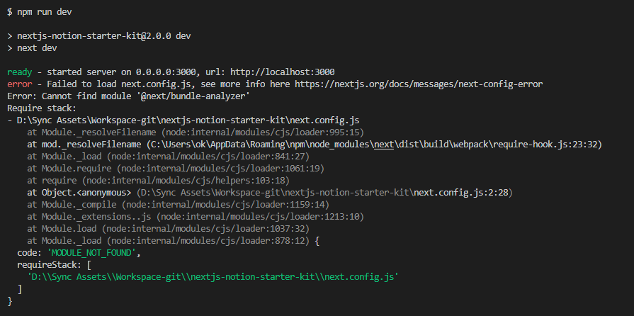

# 2022-12-18 Instalasi

## Prerequisite

Instalasi saya lakukan tanpa opsi `-g` kecuali `next`

* npm v9.2.0
* nodejs v18.12.1
* react
* react-dom
* next

## Build dan Testing

### Error Code ERESOLVE

<figure><figcaption>
npm install
</figcaption></figure>

Bisa di `--force` sehingga, error tersebut dapat diminimalisir

<figure><figcaption>
npm install --force
</figcaption></figure>

### Error Failed to load next.config.js

<figure><figcaption>
npm run dev
</figcaption></figure>

Menandakan ada error di bundle-analyzer. Setelah baca di [sini](https://www.npmjs.com/package/@next/bundle-analyzer) :

> From version 2.0.0 of next-compose-plugins you need to call bundle-analyzer in this way to work

Dan setelah diteliti siapa yang salah, ternyata saat dicoba _run_ _locally_ ada error npm ERR! `Invalid comparator: npm:@keyvhq/core@~1.6.6`. Jadi, cobalah delete node, npm dan hapus node\_modules dan clear cache.

Lalu, renungi pesan dibawah ini

<figure><figcaption>
Deploy langsung di vercel
</figcaption></figure>

## Edit sana-sini
